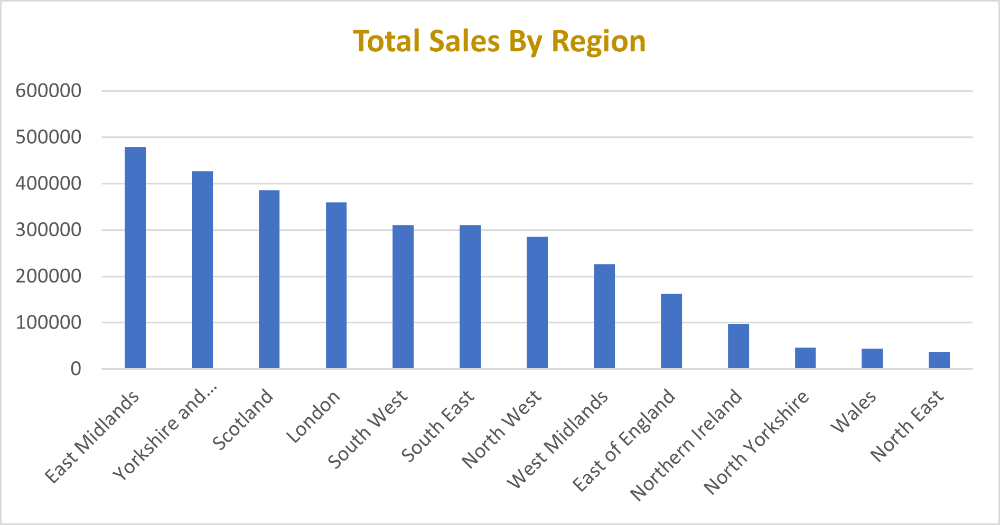
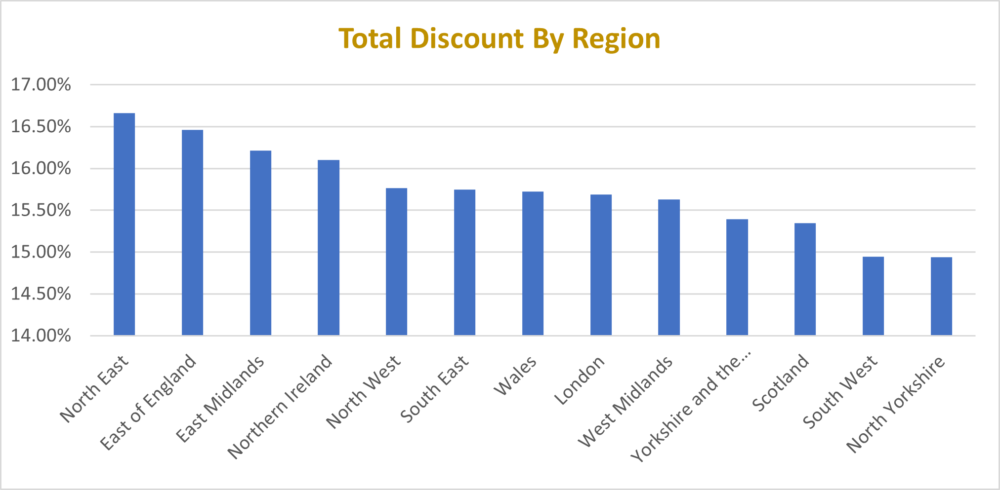

# Ace Superstore Sales Analysis Report

**Task ID**: TASK-INT001-RDAMP  
**Analyst**: [Kousar Saleem]

---

## 1. Data Cleaning Process

To ensure consistency and quality in the dataset from Ace Superstore, a detailed cleaning and transformation process was conducted before any analysis began.

### a. Column Normalization and Enrichment

The `Category` column contained compound labels such as "Food - Snacks". These were split into two distinct fields:
- `Category`: Reflects the broader product type (e.g., "Food").
- `Sub-Category`: Represents the more specific classification (e.g., "Snacks").

### b. Managing Missing Data

- Missing entries in the `Region` and `Country` columns were filled using available mappings from the `City` field.
- Any null values in the `Discount` column were replaced with 0, interpreting them as having no discount applied.

### c. Consolidating Categories

To prevent excessive fragmentation in the data:
- All clothing-related entries (e.g., "Clothing - Coats", "Clothing - Bags") were grouped under a general category named `Clothing`.
- Subcategories under domains like `Food`, `Home`, and others were standardized to reduce duplication.
- Minor categories such as "Bathroom" were merged into broader ones like `Home`.

### d. Feature Engineering

The following computed fields were added to improve financial insight:
- `Total Sales` = `Sales × Quantity`  
- `Margin` = `Sales − Cost Price`  
- `Total Margin` = `Margin × Quantity`

These new columns enabled more in-depth profitability and revenue analyses.

---

## 2. Insights and Analysis

### 2.1 Total Sales and Discount Rates by Region

  

- **Top-performing regions**:  
  East Midlands, Yorkshire and the Humber, Scotland, and London recorded the highest `Total Sales`.

- **Underperforming regions**:  
  North East, North Yorkshire, and Wales showed lower revenue levels.

- **Discount patterns**:  
  North East and East of England had average `Discount` rates over 16.5%. Wales and North Yorkshire had both low `Total Sales` and minimal discount activity, indicating missed promotional opportunities.

---

### 2.2 Top and Bottom Products by Revenue

*Charts Referenced: Top 5 best-selling products by Revenue, Top 5 underperforming products by Revenue*

**Best-selling products**:
- Portable Refrigerator Freezer: £51,380.05  
- Portable Solar Generator: £51,174.07  
- Electric Bike: £47,708.27  
- Compact Digital Camera: £33,252.43  
- Compact Dishwasher: £32,738.16  

These high-value products indicate a strong preference for electronics and utility appliances.

**Underperforming products**:
- Herb Seasoned Rice: £17.94  
- Flavored Rice Cakes: £17.88  
- Canned Black Beans: £9.03  
- Baking Soda: £8.77  
- Cinnamon Raisin Bagels: £6.38  

Low-cost grocery items with very low `Total Sales` may not justify inventory space.

---

### 2.3 High-Margin Categories

*Chart Referenced: Product Categories With Highest Margins*

**Top categories by `Total Margin`**:
- Outdoor: £281,900  
- Electronics: £280,500  
- Kitchen: £258,800  

These categories are highly profitable and should be prioritized in inventory and promotions.

**Lower margin contributors**:  
Pets, Health, and Fitness had significantly smaller margins.

---

### 2.4 Sales Distribution Across Order Mode

*Chart Referenced: Sales distribution across Order Mode*

- **Online** sales: £1,634,038.87 (52%)  
- **In-Store** sales: £1,536,872.95 (48%)

Online has a slight lead, indicating the importance of maintaining and improving the e-commerce channel.

---

## 3. Conclusion and Recommendations

### Conclusion

Sales performance is strong in the Online channel and in categories like Electronics, Outdoor, and Kitchen. Certain regions and low-value items underperform, affecting overall efficiency.

### Recommendations

- Expand high-margin categories (Outdoor, Electronics, Kitchen).
- Review regional strategies, especially for North East and Wales.
- Align discounts with sales behavior to boost engagement.
- Phase out or bundle low-revenue grocery items.
- Invest in online platform enhancements, delivery speed, and customer experience.
- Explore customer-level margin analysis and predictive modeling for proactive planning.

---

> **Tool Used**: Excel was used for data cleaning, analysis, and visualization.

